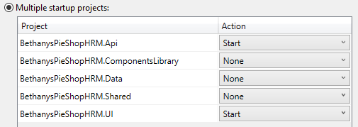

# Organizzazione dell'applicazione

## La Solution

La Soluzione sopra visualizzata è un esempio di organizzazione dell'applicazione che consente una corretta _suddivisione logica_.

La soluzione è divisa in __5 progetti__.

È necessario configurare l'avvio multiplo: prima il progetto __API__ e dopo il progetto __UI__.

### I progetti

1. __Api__

    

    È il progetto che avvia il sito delle __REST Api__.\
    Contiene i Controllers, lo Startup e l'appsettings.

2. __ComponentsLibrary__

    contiene l'integrazione con OpenStreetmap, pensata per diventare un package NuGet

3. __Data__

    DbContext e Repositories (con relative interfaccie) per il recupero e aggiornamento dei dati

4. __Shared__

    modelli dati (comprese data annotations per validazione)

5. __UI__

    

    a. Components\
    _componenti ad uso dell'interfaccia (modali)_

    b. Pages\
    _le pagine con i relativi Code Behind_

    c. Interfaces\
    _interfaccie ai servizi_

    d. Services\
    _servizi per recupero dati via API_

    e.Shared\
    _NavMenu e MainLayout_

## Analisi

### API e Data
L'organizzazione corretta di un progetto può unificare __Api__ e __Data__ all'interno di un'unico progetto chiamato __Api__.

Mantenere separati i progetti ha senso se in prospettiva si pensa di utilizzare un'altra forma di fruizione dei dati oltre alla Rest API.\
Potrebbe essere un ragionamento interessante in funzione di avere una fruizione via __GraphQL__.\
Da valutare progetto per progetto.

| Progetto | Dipende da |
| -------- | ---------- |
| Data | Shared |
| Api | Data, Shared |

 

### ComponentsLibrary

La __ComponentsLibrary__ potrebbe essere un'idea interessante, ma solamente per aree fortemente trasversali.\
L'esempio della mappa via OpenStreet è una buona idea.\
| Progetto | Dipende da |
| -------- | ---------- |
| ComponentsLibrary | _nessuno_ |

 

### Shared

Il progetto __Shared__ accentra modelli dati e validazioni.\
Normalmente mantengo separate le validazioni per ottimizzare i View Model.\
Qui è meglio mantenere _solamente_ i modelli dati, senza validazioni.

| Progetto | Dipende da |
| -------- | ---------- |
| Shared | _nessuno_ |

 

### UI

La __UI__ è correttamente separata.

| Progetto | Dipende da |
| -------- | ---------- |
| Data | Shared, ComponentsLibrary |

